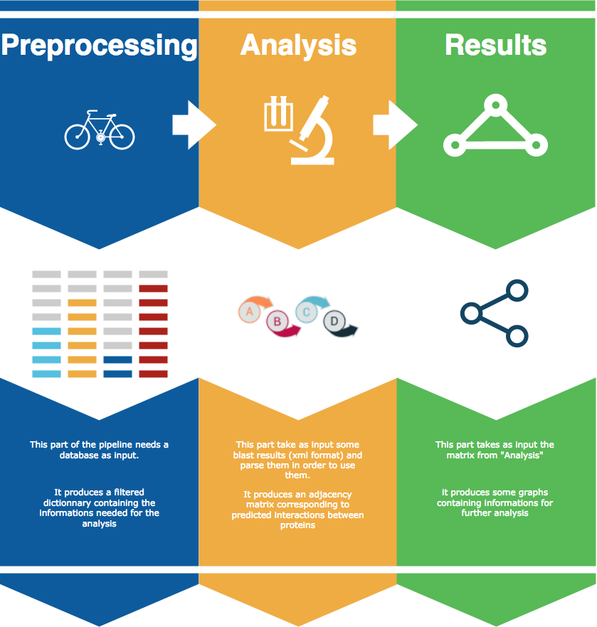

<p align="center"></p>

Finding new interactions between proteins in a proteome, based on sequence homology.



## Getting Started

These instructions will get you a copy of the project up and running on your local machine for development and testing purposes. 

### Prerequisites


This pipeline is currently using [Jupyter](http://jupyter.org/) to work.

It also use [Python 2.7](https://www.python.org/download/releases/2.7/) and more particularly these packages :


```python
import sys
import networkx as nx
import numpy as np
import matplotlib.pyplot as plt
import copy
import json
```


### Installing

First of all, you have to download the full package.

The first step is to clone the git repository. In order to do that, open a terminal console and write this

command line :

```
git clone https://github.com/glaunay/omegaLoMo.git 
```

Import the package to your .py project

```
import PACKAGE_PATH.core as core
import PACKAGE_PATH.createTopo as cT
import PACKAGE_PATH.graph as graph
import smallWork as sW
```


## Running the tests

After downloading the package and the serialized data, check the Run_Analsis jupyter notebook in order to use the pipeline.

Serialized files contains :

>indexR6

>>List of the full proteome of our organism

>newDic.json

>>Dictionnary containing all interaction extract from Intact (physical interactions with Uniprot Id)

>FullOmegaSet_coverage.json

>>Contains all information recquired to build the graph

>divKnownR6.txt

>> <div class="alert alert-info"><a href=http://www.uniprot.org/uniprot/?query=taxonomy:%22Streptococcus%20pneumoniae%20(strain%20ATCC%20BAA-255%20/%20R6)%20[171101]%22+go:51301> File download from uniprot </div>


At the end, you should be able to observe some graphs corresponding to the first neighbors of each proteins of interest.

These are the predicted interactions proteins-proteins in the genome of your organism.


## Deployment

If you want to use this pipeline with your own data set, make sure to check all input format


## Built With

* [Jupyter](http://jupyter.org/) - An open-source web application


## Authors

* **Loïc Barlet** - *Initial work* - [LoBarlet](https://github.com/LoBarlet)
* **Mohamed Bachir-Cherif** - *Initial work* - [mbachircherif](https://github.com/mbachircherif)
* **Guillaume Launay** - *Initial work* - [glaunay](https://github.com/glaunay)


